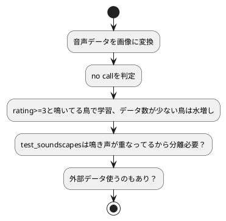

# BirdCLEF 2022

- [BirdCLEF 2022](#birdclef-2022)
  - [1. Abstract](#1-abstract)
  - [2. データ](#2-データ)
    - [2-1. train_metadata.csv](#2-1-train_metadatacsv)
    - [2-2. 緯度経度プロット](#2-2-緯度経度プロット)
    - [2-3. rating の分布](#2-3-rating-の分布)
    - [2-4. データラベルの wordcloud](#2-4-データラベルの-wordcloud)
    - [2-5. test.ogg の波形](#2-5-testogg-の波形)
    - [2-6. test.ogg をメルスペクトログラムに変換](#2-6-testogg-をメルスペクトログラムに変換)
  - [3. フロー](#3-フロー)

## 1. Abstract

https://www.kaggle.com/competitions/birdclef-2022

> As the “extinction capital of the world,” Hawai'i has lost 68% of its bird species, the consequences of which can harm entire food chains. Researchers use population monitoring to understand how native birds react to changes in the environment and conservation efforts. But many of the remaining birds across the islands are isolated in difficult-to-access, high-elevation habitats. With physical monitoring difficult, scientists have turned to sound recordings. Known as bioacoustic monitoring, this approach could provide a passive, low labor, and cost-effective strategy for studying endangered bird populations.
> Current methods for processing large bioacoustic datasets involve manual annotation of each recording. This requires specialized training and prohibitively large amounts of time. Thankfully, recent advances in machine learning have made it possible to automatically identify bird songs for common species with ample training data. However, it remains challenging to develop such tools for rare and endangered species, such as those in Hawai'i.
> The Cornell Lab of Ornithology's K. Lisa Yang Center for Conservation Bioacoustics (KLY-CCB) develops and applies innovative conservation technologies across multiple ecological scales to inspire and inform the conservation of wildlife and habitats. KLY-CCB does this by collecting and interpreting sounds in nature and they've joined forces with Google Bioacoustics Group, LifeCLEF, Listening Observatory for Hawaiian Ecosystems (LOHE) Bioacoustics Lab at the University of Hawai'i at Hilo, and Xeno-Canto for this competition.
> In this competition, you’ll use your machine learning skills to identify bird species by sound. Specifically, you'll develop a model that can process continuous audio data and then acoustically recognize the species. The best entries will be able to train reliable classifiers with limited training data.
> If successful, you'll help advance the science of bioacoustics and support ongoing research to protect endangered Hawaiian birds. Thanks to your innovations, it will be easier for researchers and conservation practitioners to accurately survey population trends. They'll be able to regularly and more effectively evaluate threats and adjust their conservation actions.

## 2. データ

### 2-1. train_metadata.csv

-   `primary_label`
    鳥の種類のコード。`https://ebird.org/species/`で詳しくわかる。American Crow なら`https://ebird.org/species/amecro`で検索。アメクロになる。
-   `secondary_labels`
    録音されてる鳥の種類は一種類じゃない。レコーディングされた鳥が複数種だとここにその種類が入る。`null`だと背景に鳥はいない。
-   `author`
    録音した人。eBird ユーザー
-   `filename`
    オーディオファイルに紐づく。
-   `rating`
    0.0~5.0 の間を取る。Xeno-canto 基準の品質とバックグラウンドで鳴いてる鳥の種類数が影響して決まる。5.0 は良、1.0 は悪。0 は未評価。

### 2-2. 緯度経度プロット

@import "src\distribution.html"

### 2-3. rating の分布

@import "src\rating.html"

### 2-4. データラベルの wordcloud

Barn Owl と Owl Barn がいる。ちなみにこれはメンフクロウ。

@import "src\wordcloud.png"

### 2-5. test.ogg の波形

@import "src\waveform.png"

### 2-6. test.ogg をメルスペクトログラムに変換

音声データを短時間フーリエ変換(Short Time Fourier Transform:STFT)して画像としたものの振れ幅スペクトルにメルフィルターバンクを適用させメル尺度に変換したもの。

@import "src\melspectrogram.png"

## 3. フロー

